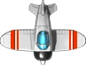
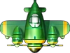
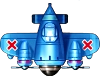
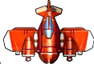

# Aircraft Battle

## Introduction
This game is designed to defeat the enemy planes by operating a falcon represented by Robert Alef's falcon design. 
Player has 5 falcons initially. Falcon is invincible if it is in protected status (i.e., colored green with circle shield);
otherwise, player will lose one falcon whenever it hits any enemy planes or red brick boundary or
bullets fired by enemies. Player should attack enemies by firing bullets to get scores for next level.

## Instructions
- Launch this game by running `src\main\java\_game\mvc\controller\Game`
- Press the left and right arrow keys to turn falcon, falcon is in normal status
- Press the space bar to fire bullets, falcon is in normal status
- Press the up arrow keys to thrust, falcon is in accelerating status
- At the start of game or the new falcon, falcon is in protected status
- When hitting a green shield floater, falcon is in protected status
- When hitting an orange nuke floater, press 'N' to use it
- When hitting a red square floater, the red wall will be generated in boundaries

## Falcon Statues
- Falcon is rendered in white color if it is in normal status
- Falcon is rendered in orange color if it is in accelerating status
- Falcon is rendered in green color if it is in protected status

## Enemy Planes

- White plane flies in a straight vertical route, the falcon just needs to stay away from it since it is not aggressive.

- Green plane has the same air route as white plane, but it fires red bullets. Falcon should be aware of it and keep out of it. 

- Blue plane works like green plane, but it can fire more bullets

- Red plane does not fire bullets, but it can track the location of falcon and move towards to it.

Images Source: "Thunder Raid" by Tencent.

